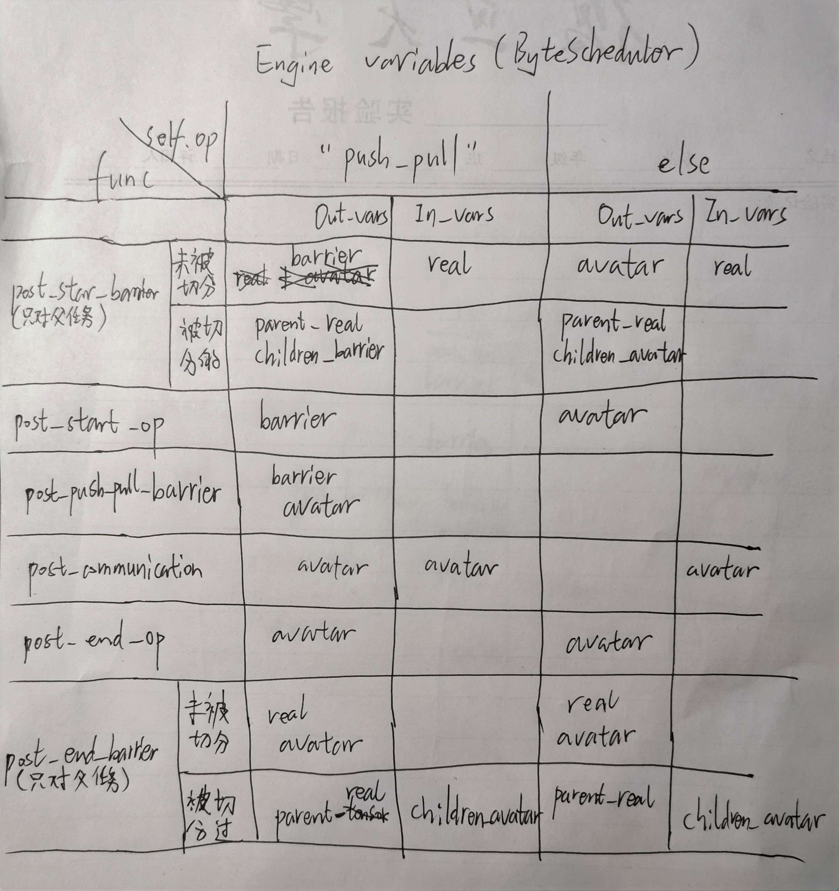

ByteScheduler

# 1 arch


上图左边是没有ByteScheduler 的原始 mxnet push调用依赖uml图，右图是加入了ByteScheduler 的uml图。可见ByteScheduler舍弃了 _LIB和c++类 KVStoreDist，而对 python类 KVStore进行新的封装重写，得到ScheduledKVStore。且ScheduledKVStore的实现依赖于原始 KVStore的一些方法和Engine。

# 2 Classes

## ScheduledKVStore（继承自 mx.kvstore.KVStore）

- 重写mx.kvstore.KVStore的三个methods：init()   push()   pull()。 之后使用中用这个类代替原来的类来使用。用法：

  ```python
  import mxnet as mx
  
  # Create kvstore
  kv = mx.kvstore.create("dist_sync")
  
  # Wrap kvstore using ScheduledKVStore
  from bytescheduler.mxnet.kvstore import ScheduledKVStore
  kv = ScheduledKVStore(kv)
  
  # Continue
  ```

  

methods:

- init()   

  core 是 ByteCore类实例, 调用 ByteCore.post() 加入新任务。初始化新任务时设置 ByteTask.\_comm=self._kvstore

  ```python
  task = KVStoreTask( key,  value, "init",  priority=0, comm=self._kvstore,
              immediate=True, step=self._step, rank=self._rank,
              key_index=self._str_key_int[key],
          )
          core.post(task)
  ```

  

- push()

  这里并没有调用ByteCore.post() ，只是把tensor加入 buffer中，并在pull() 中执行 push-pull 双合一的task。可能是因为作者设计的机制是 push() 之后立即执行 pull()，没有global barrier。 

  ```python
      def push(self, key, value, priority=0):
          """Override the default one.
          Key or value can be single element or list. In MXNet, key is a string and value is a list of NDArray with
          length equal to # of executors/devices
          """
          self._push_buffer[key] = (key, value, priority)
  ```

- pull()

  调用 ByteCore.post() 加入新任务。初始化新任务时设置 ByteTask.\_comm=self._kvstore
  
  ```python
          if key not in self._push_buffer:
          	······
              task = KVStoreTask(
                  key,  out,  "pull",
                  ······
              )
              core.post(task)
          else:
  			······
              # Merge push and pull into one task
              (_key, _value, _priority) = self._push_buffer[key]
              task = KVStoreTask(
                  key,   (_value, out),  "push_pull",
                  priority=-priority, comm=self._kvstore,
                  ······
              )
              del self._push_buffer[key]
            core.post(task)
  ```
  
  

## ByteCore

- The core of ByteScheduler. Once Core gets a ByteTask (which represents a communication operation, e.g., push,    allreduce), it partitions the ByteTask and decides when to send each partition according to priority.

members：

- self._queue

  self._queue = queue.PriorityQueue()  。 A priority queue of ByteTask, tasks are sorted according to its priority.

methods:

- start()

  开启 _loop() 的处理线程。(这个start方法被ScheduledKVStore 的创建函数 \_\_init__ 调用 )
  
  ```python
  self._scheduler = threading.Thread(target=self._loop, args=())
self._scheduler.start()
  ```

- _loop()

  - The main scheduling logic is a while loop that pops a task from queue each time and do it if **credit** is enough. The credit decreases when a task is running and increases when a task is finished.

  - 调用 ByteTask.do()  进行处理, 并传入 _end_callback (作为 ByteTask中的 _do_callback)。

  ```python
          while True:
              with self._condition:
                  while True:
                      try:
                          priority, cmd, task = self._queue.get(False)
                      except:
                          # wait for (potential) new task
                          self._condition.wait()
                          continue
                      if task and self._credit <= 0:
                          self._queue.put((priority, cmd, task))
                          # wait for (potential) new credit
                          self._condition.wait()
                      else:
                          break
  
              if cmd == self._commands['EXIT']:
                  break
              else:
                  self._profiler.put(task.name, task.op + 'QUEUE', 'E')
                  with self._condition:
                      self._running.add(task)
                      self._credit -= task.tensor_size()
                  task.do(callback=_end_callback, callback_context=self)
                  self._profiler.put(task.name, task.op + 'COMMUNICATION', 'B')
  ```

- post()

  - 首先调用 ByteTask.partition() 对tensor切分，得到子 tasks, 再如下处理这些子 tasks.
  - 如果是immediate task，调用 **ByteTask.immediate_do()** 处理，并传入 _end_callback (作为 ByteTask中的 **\_do_callback** )。
  
  - 否则，调用 **ByteTask.prepare()** 处理，并传入 \_start_callback (作为ByteTask中的 **\_prepare_callback** )。 **\_prepare_callback**  的作用是prepare处理完了之后会把 这些 task 加入进 self._queue 中，供 _loop() 线程处理。 而 _loop() 线程会根据 credit调度处理task，具体为调用 **ByteTask.do()**  进行处理, 并传入 _end_callback (作为 ByteTask中的 **\_do_callback**) 。
  - immediate_task 相比与一般的 task，不用进入self._queue 中进行调度，所以也没有 \_prepare_callback.
  
  ```python
              # Partition a task if its tensor is larger than a threshold.
              if task.tensor_size() > self._partition:
                  subtasks = task.partition(size=self._partition)
              else:
                  subtasks = [task]
  
              # A task will bypass scheduling and start immediately after partition if immediate is True.
              if task.is_immediate():
                  # The callback runs after an immediate task is finished.
                  def _end_callback(t, self): ······
  
                  for t in subtasks:
                      with self._condition:
                          self._running.add(t)
                      self._profiler.put(t.name, t.op + 'COMMUNICATION', 'B')
                      t.immediate_do(callback=_end_callback, callback_context=self)
                  return True
              # The callback runs when a non-immediate task is ready.
              def _start_callback(task, self):
                  ······
                  self._queue.put((task.priority, self._commands['DATA'], task))
              # Prepare the task, i.e., add dependency Proxies.
              for t in subtasks:
                  with self._pending_lock:
                      self._pending.add(t)
                  t.prepare(callback=_start_callback, callback_context=self)
              return True
  ```

  
  

## ByteTask

- A unified communication operation (e.g., push, pull, allreduce) abstraction for ALL ML frameworks and
      communication methods.

methods:

- partition()

   - Return a list of partitioned children tasks (many ByteTask instances)

   - Core calls this interface to partition a CommTask into one or multiple SubCommTasks with tensors no larger than *size*, which invokes a callback in the plugin as tensor partitioning is framework-dependent.

   Core then schedules those partitioned CommTasks. This incurs low overhead because all popular frameworks provide zero-copy APIs for partitioning the underlying tensor.

- immediate_do()

   设置 self._do_callback，调用 KVStoreTask的 _immediate_do() --> KVStoreTask的 _prepare()

- prepare()

   设置 self._prepare_callback，调用 KVStoreTask的 _prepare()

- do() 

   设置 self._do_callback，调用 KVStoreTask的 _do()

- notify_ready()

   - 调用 self._prepare_callback()

   - Most ML frameworks are asynchronous – when a communication operation is posted to the engine, possibly the tensor has not been computed or ready to be sent. We let the engine use this interface to notify Core about a tensor being ready, so that Core can actually begin scheduling it. We will explain how we achieve this generically and without modifying the engines in §3.3.

- notify_finish()

   - 调用 self._do_callback()
- Once the communication of a tensor (all-reduce, push or pull) has been finished, the framework engine must notify Core about this, so that Core can continue scheduling more Tasks. More details are in §3.3
  
   

## KVStoreTask (继承自 ByteTask)


它的几个函数实现原论文中的 Dependency Proxy 功能。以下为原论文中的描述：


> **Dependency Proxy**: A Proxy is an operation created by ByteScheduler. It can be posted into the framework engines, and claim dependencies from/to other operations. Declarative engines all provide direct APIs to define such dependencies since this is the fundamental feature of such engines. 
>
> ​	If a communication operation must happen after a computation operation in the original order, *e.g.*, the computation operation generates the gradients to be sent, we will post a Proxy to the engine. It claims to depend on the finish of the computation operation, and also to be precedent to the communication operation, as shown in Figure 6.
>
> ​	Proxy does only two things. First, once it is started by the engine, it will trigger the corresponding *CommTask.notify_ready()* via a callback, because the start of Proxy means the original precedent operations of the communication operation have been finished. Second, it will not finish until Core tells it to end via *CommTask.start()*. Because it is one precedence of the communication operation, it effectively delays the communication operation until being scheduled by Core.
>
> ​	Proxy has very low overhead – before Proxy ends, it is blocked by a lock and yields the CPU resources (in the case of imperative engines), or simply “finishes” without calling the *on_complete()* callback provided by the engine (in the case of declarative engines). Core will call *CommTask.start()*, which includes the engine’s *on_complete()*.
>
> ​	For MXNet, we post another type of Proxy right after the communication operation and claim dependency on it. This Proxy only generates completion signal using *CommTask.notify_finish()* once it is started by the engine. 

这里先把这个类中调用Engine的所有函数的依赖关系，即所传入的的 mutable_vars 和 const_vars 整理出来：



methods:

- _immediate_do()

  调用 self._prepare()

- _prepare()

  先产生 real 和 avatar，之后处理.  具体见下。共有两种类型任务：
  
  - 其中，未被切分的任务：**real：self.\_tensor**的handle list； **avatar： a new handle list** of self.\_tensor
  
  - 任务被切分所生成的子任务：**real ：self.parent.\_tensor** 的handle list，**avatar：self.\_tensor** handle list（**这也是新的handle list，因为partition的时候已经对子任务进行了创建新handle list操作**）


  ```python
  """Post start barrier OP, start OP, comm OP, end OP and end barrier OP to MXNet engine. The function of each kind of OP is explained below.
  --- start barrier OP:  barrier the start of a parent ByteTask, used to maintain original dependency.
  --- start OP:          It notifies Core about task readiness. It is also used to delay the start of a child ByteTask.
  --- comm OP:           the OP that does real communication, e.g., push, pull, allreduce.
  --- end OP:            an OP that runs after a child ByteTask is finished. It notifies Core about the task completion.
  --- end barrier OP:    an OP that runs after the parent ByteTask is finished, used to maintain original dependency.
  
  Below are several key data structures.
  
  self._tensor: a list of NDArrays of the same key of all devices. If push_pull, self._tensor includes push list and pull list of NDArrays of all devices.
  real: the original handle list of self._tensor, used for keep dependency.
  avatar: a new handle list of self._tensor.
  """
  ```

  ```python
          ......
    	  self._post_start_barrier(avatar, real)
          self._post_start_op(avatar)
          self._post_push_pull_barrier(avatar)
  
          # post real op
          if self.parent is None:
              self._post_communication(self._avatar)
          else:
              self._post_communication(self._tensor)
  
          self._post_end_op(avatar)
  
          self._post_end_barrier(avatar, real)
  ```

- _post_start_barrier(avatar, real)  (只针对父任务执行一次)

  """The start barrier is for keeping the original dependency. It does not need any callback."""

  - **未被切分的任务**（即if self.parent is None），调用 BYTESCHEDULER_LIB.bytescheduler_mxnet_barrier:
    - tensor_in: （即之后调用 Engine::PushAsync 的 const_vars）自己 **real tensor**。其目的是等待之前关于自己tensor的 “BP”步骤完成。
    - tensor_out:（即之后调用 Engine::PushAsync 的 mutable_vars）"push_pull": **self._barrier_tensor**; else: **self.avatar**.
  - **被切分所生成的子任务的父任务**: 调用 BYTESCHEDULER_LIB.bytescheduler_mxnet_barrier（对同一个parent，只调用一次）:
    - tensor_in: none
    - tensor_out: "push_pull": **self.parent.\_tensor+ children_barrier_tensors**; else: **self.parent.\_tensor+ children_avatars**
      - （self.parent.\_tensor 即指输入参数中的 real）（这里的children_avatars就是children_tensors。因其是新的handle list，这样写更容易理解）

  上述中的 **real tensor** 和**self.parent.\_tensor** 都是为了保持原来的dependency，即模仿未重写KVStore前 push操作对上文操作所形成的依赖关系，即等待对应tensor的 BP.Op结束（只针对所有的父任务）。而“push_pull”任务则用 **_barrier_tensor** 形成之后的操作对当前操作的依赖，其他的操作则使用 **avatar** 形成之后的操作对当前操作的依赖。

  ```python
          if self.parent is None:  #未被切分的任务
              barrier_tensors_in = (NDArrayHandle * len(real))(*real)
              if self.op == "push_pull":
                  tensor_out = [self._barrier_tensor.handle]
              else:
                  tensor_out = avatar
              barrier_tensors_out = (NDArrayHandle * len(tensor_out))(*tensor_out)
              check_call(BYTESCHEDULER_LIB.bytescheduler_mxnet_barrier(
                  barrier_tensors_in, len(real),
                  barrier_tensors_out, len(tensor_out),
                  10000000-self.priority))
          else:
              if hasattr(self.parent, "_posted_start_barrier"):
                  return
              self.parent._posted_start_barrier = True
              if self.op == "push_pull":
                  push_pull_barriers = []
                  for child in self.parent.children:
                      push_pull_barriers.append(child._barrier_tensor.handle)
                  deps = real + push_pull_barriers
              else:
                  children_tensors = []
                  for child in self.parent.children:
                      if isinstance(child._tensor, (tuple, list)):
                          for t in child._tensor:
                              # including push tensor and pull tensor
                              if isinstance(t, (tuple, list)):
                                  children_tensors += [tt.handle for tt in t]
                              else:
                                  children_tensors += [t.handle]
                      else:
                          children_tensors += [child._tensor.handle]
                  deps = real + children_tensors
              barrier_tensors_out = (NDArrayHandle * len(deps))(*deps)
              check_call(BYTESCHEDULER_LIB.bytescheduler_mxnet_barrier(
                  barrier_tensors_out, 0,
                  barrier_tensors_out, len(deps),
                  10000000-self.priority))
  ```

  

- _post_start_op(avatar)

  

  - 调用 BYTESCHEDULER_LIB.bytescheduler_mxnet_op() 在Engine中建立一个 **Proxy** 线程(会被 Engine 调度资源异步执行)。该Proxy即为上图Figure6 中图上部的 Proxy。该线程会调用 **ByteTask.notify_ready()** ，它会执行 ByteTask._prepare_callback()，即在**Core**中把 task 放入queue中，供Core的 _loop() 线程调度任务。

  - 如果是 **immediate** 任务，这个函数直接返回，不会执行。

    >  或者是另一种解决方案：程序会直接调用 BYTESCHEDULER_LIB.bytescheduler_mxnet_on_complete 运行 on_complete 这个函数。on_complete 是 当前 Proxy 的end callback，运行它即意味着当前 Proxy 完成，可直接执行 **Comm.Op** 。

  - 如果是一般任务，当前 on_complete 被暂时保存下来，等待 **self._do()** 来执行这个 on_complete。 而这个 self._do() 只会被 **Core.\_loop()** 调用。<font color=red>所以 当 Core.\_loop() 线程在执行调度算法之中调用这个任务的 KVStoreTask.\_do() 时，实际上相当于实现了上图的 Core 执行 **CommTask.start()**。 作用是结束 Proxy，开始运行该任务的 **Comm.Op**</font>

    - 调用 bytescheduler_mxnet_op() 的参数为:
      - tensor_in:     none。
      - tensor_out:    "push_pull": **self._barrier_tensor**,  else : **self.avatar** 

  ```python
          if self._immediate: #
              return
          
      	def start_callback(on_complete):
              if self._immediate:
                  # call on_complete directly
                  check_call(BYTESCHEDULER_LIB.bytescheduler_mxnet_on_complete(
                      c_void_p(on_complete)))
                  return
              self._on_complete = on_complete
              self.notify_ready()
  
          # avoid garbage collection
          self._mxnet_start_callback = callback_t(start_callback)
          # post start op
          
          if self.op == "push_pull":
              tensor_out = (NDArrayHandle * 1)(*[self._barrier_tensor.handle])
              check_call(BYTESCHEDULER_LIB.bytescheduler_mxnet_op(
                  tensor_out, 0, tensor_out, 1, self._mxnet_start_callback, 1000000-self.priority))
          else:
              tensor_out = (NDArrayHandle * len(avatar))(*avatar)
              check_call(BYTESCHEDULER_LIB.bytescheduler_mxnet_op(
                  tensor_out, 0, tensor_out, len(avatar), self._mxnet_start_callback, 1000000-self.priority))
  ```

- _post_push_pull_barrier(avatar)

  <font color=red>运行 self\._comm\.push(self.\_barrier_tensor) , 暂时不知道用意。</font>
  
  “push_pull”操作时，建立 post_start_op所产生的proxy与 Comm.Op 之间的依赖关系。
  
  **if self.op is "push_pull"**，调用 BYTESCHEDULER_LIB.bytescheduler_mxnet_barrier:
  
  - tensor_in:  none
  - tensor_out:   **[self._barrier_tensor.handle] + avatar**
  
  
  
  ```python
        if self.op == "push_pull":
              # push barrier and write dependency on barrier tensor and avatar with highest priority
              self._comm.push(self._barrier_key, self._barrier_tensor, -self.priority)
              deps = [self._barrier_tensor.handle] + avatar
              barrier_tensors_out = (NDArrayHandle * len(deps))(*deps)
              check_call(BYTESCHEDULER_LIB.bytescheduler_mxnet_barrier(
                  barrier_tensors_out, 0,
                  barrier_tensors_out, len(deps),
                  10000000 - self.priority))
  ```
  
  
  
- _post_communication(avatar)

  调用self.\_comm.push(), self.\_comm.pull() 真正完成传输, 也即 figure 6 中的 **Comm.Op**。这里的 self.\_comm 就是原始的被封装起来的 mx.kvstore.KVStore 类的实例

- _post_end_op(avatar)

  调用 BYTESCHEDULER_LIB.bytescheduler_mxnet_op() 在Engine中建立一个 **Proxy** 线程(会被 Engine 调度资源异步执行)。该Proxy即为上图Figure6 中图下部的 Proxy。该线程会调用 **ByteTask.notify_finish()** ，它会执行 ByteTask._do_callback()。与 _post_start_op() 不同的是，\_post_end_op() 产生的Proxy会立即调用自己的 on_complete, 立即结束自己，不对原始计算流程添加任何额外依赖。

  - 调用 BYTESCHEDULER_LIB.bytescheduler_mxnet_op:
  
  - tensor_in:  none
  - tensor_out:   **avatar**
  
  ```python
          def end_callback(on_complete):
              # call on_complete directly
              check_call(BYTESCHEDULER_LIB.bytescheduler_mxnet_on_complete(
                  c_void_p(on_complete)))
              self.notify_finish()
  
          # avoid garbage collection
          self._mxnet_end_callback = callback_t(end_callback)
  
          # post end op
          tensor_out = (NDArrayHandle * len(avatar))(*avatar)
          check_call(BYTESCHEDULER_LIB.bytescheduler_mxnet_op(
              tensor_out, 0, tensor_out, len(avatar), self._mxnet_end_callback, 1000000-self.priority))
  ```
  
  
  
- _post_end_barrier(avatar, real) (只针对父任务执行一次)

  - **未被切分任务**，调用 BYTESCHEDULER_LIB.bytescheduler_mxnet_barrier（对同一个parent，只调用一次）:

    - tensor_in: none

    -  tensor_out: **real + avatar**

  - **被切分任务的子任务的父任务**, 调用 BYTESCHEDULER_LIB.bytescheduler_mxnet_barrier（对同一个parent，只调用一次）:

    - tensor_in: **all_children_avatars**
    - tensor_out: **self.parent.\_tensor**

  上述的 **real** 和**self.parent._tensor** 都是为了保持原来的dependency，即模仿未重写KVStore前 pull操作对下文操作所形成的依赖关系.

  ```python
          """The end barrier is for keeping the original dependency. It does not need any callback."""
          if self.parent is None:
              deps = real + avatar
              barrier_tensors_out = (NDArrayHandle * len(deps))(*deps)
              check_call(BYTESCHEDULER_LIB.bytescheduler_mxnet_barrier(
                  barrier_tensors_out, 0,
                  barrier_tensors_out, len(deps),
                  10000000-self.priority))
          else:
              # _child_tensors is a list of avatar, and avatar itself is also a list
              if not hasattr(self.parent, "_children_tensors"):
                  self.parent._children_tensors = [avatar]
              else:
                  self.parent._children_tensors.append(avatar)
              if len(self.parent._children_tensors) == len(self.parent.children):
                  tensors_in = [_ for sublist in self.parent._children_tensors for _ in sublist]
                  barrier_tensors_in = (NDArrayHandle * len(tensors_in))(*tensors_in)
                  barrier_tensors_out = (NDArrayHandle * len(real))(*real)
                  check_call(BYTESCHEDULER_LIB.bytescheduler_mxnet_barrier(
                      barrier_tensors_in, len(tensors_in),
                      barrier_tensors_out, len(real),
                      10000000-self.priority))
  ```

  

- _do()

  调用 BYTESCHEDULER_LIB.bytescheduler_mxnet_on_complete(), 执行之前在 _post_start_op() 中保存下来的 on_complete , 从而结束那个 Proxy。

  ```python
          if hasattr(self, "_on_complete"):
              check_call(BYTESCHEDULER_LIB.bytescheduler_mxnet_on_complete(
                  c_void_p(self._on_complete)))
  ```


## BYTESCHEDULER_LIB（python instance for c++ lib)

functions:

- bytescheduler_mxnet_on_complete

  其他函数会调用 Engine::Get()->PushAsync()异步执行某个操作，本函数在这个操作完成后执行 mxnet_on_complete 这个 Callback。本函数给python层面提供一个接口，使得python层面可以自由定义与这个Callback一并运行的一些指令。

- bytescheduler_mxnet_op

  -    参数：                     （NDArray** in_tensor,	 int in_count,
                                          NDArray** out_tensor, 	int out_count,
                                          bytescheduler_callback_t      callback,
                                          int priority）

  调用 Engine::Get()->PushAsync() 执行 mxnet_op 函数线程，mxnet_op 中只是执行了传入的 callback。用来实现 Dependency Proxy。

  ```c++
      auto mxnet_op = [callback](RunContext rctx, Callback on_complete) mutable {
          Callback *p = new Callback(on_complete);
          callback((void*)p);
      };
  
      Engine::Get()->PushAsync(mxnet_op, Context::CPU(), in_var, out_var,
                               FnProperty::kCPUPrioritized, priority, ByteSchedulerOp");
  ```

  

- bytescheduler_mxnet_barrier

  作用同上bytescheduler_mxnet_op，可能只为实现依赖

- bytescheduler_get_ndarray_avatar(NDArray* tensor, NDArrayHandle *out)

  - 为python中的 NDArray 实例在c++中新建一个映射，数据相同。这样 python层面就多了一个实例和handle。<font color=red>暂时不知道这样做的用意。</font>
  - 被  KVStoreTask.\_prepare() 和 KVStoreTask.\_partition_single_tensor() 调用，用于生成 **avatar** : a new handle list of self._tensor.

# 3 Auto-tuning

## Env variable

ByteCore.\__init__()

```python
# Partition unit, i.e., the number of parameters
self._partition = int(os.environ.get('BYTESCHEDULER_PARTITION', 1000000))

# Credit, i.e., the max number of unacknowledged parameters
self._credit = float(os.environ.get('BYTESCHEDULER_CREDIT', 4000000))
self._credit_limit = self._credit

# We expect that the first key is same across iterations and we use it to count how many training steps have
# been run.
self._first_key = None
self._step = 0

# Tuning
self._credit_tuning = int(os.environ.get('BYTESCHEDULER_CREDIT_TUNING', 1))
self._partition_tuning = int(os.environ.get('BYTESCHEDULER_PARTITION_TUNING', 0))
```

## Turning range & frequency


Turner.\__init__()   

```python
        if credit_tuning:
            if arch == "ps":
                space["credit"] = (1.0, 16.0)
            else:
                space["credit"] = (4.0, 64.0)

        if partition_tuning:
            space["partition"] = (2.0, 32.0)

        max_num_steps = 15
```

Turner.record()   

```python
# By default average the training time of 100 step as one point.
if len(self._timestamps) > 100:
    self._tune(current_point, step)
```


