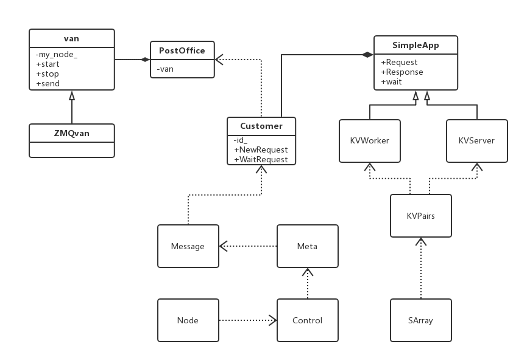

# ps-lite

## 1, main classes



- Postoffice是全局管理类，单例模式创建。主要用来配置当前node的一些信息，例如当前node是哪种类型(server,worker,scheduler)，nodeid是啥，以及worker/server 的rank 到 node id的转换。
- Van是负责通信的类，是Postoffice的成员。Van中std::unordered_map<int, void*> senders_保存了node_id到连接的映射。Van只是定义了接口，具体实现是依赖ZMQ实现的ZMQVan，Van类负责建立起节点之间的互相连接（例如Worker与Scheduler之间的连接），并且开启本地的receiving thread用来监听收到的message。
- Customer用来通信，跟踪request和response。每一个连接对应一个Customer实例，连接对方的id和Customer实例的id相同。
- SimpleApp是一个基类；提供了发送接收int型的head和string型的body消息，以及注册消息处理函数。它有2个派生类。
- KVServer是SimpleApp的派生类，用来保存key-values数据。里面的Process()被注册到Customer对象中，当Customer对象的receiving thread接受到消息时，就调用Process()对数据进行处理。
- KVWorker是SimpleApp的派生类，主要有Push()和Pull()，它们最后都会调用Send()函数，Send()对KVPairs进行切分，因为每个Server只保留一部分参数，因此切分后的SlicedKVpairs就会被发送给不同的Server。切分函数可以由用户自行重写，默认为DefaultSlicer，每个SlicedKVPairs被包装成Message对象，然后用van::send()发送。
- KVPairs封装了Key-Value结构，还包含了一个长度选项。
- SArray是Shared array，像智能指针一样共享数据，接口类似vector。
- Node封装了节点的信息，例如角色、ip、端口、是否是恢复节点。
- Control封装了控制信息，例如命令类型、目的节点、barrier_group的id、签名。
- Meta封装了元数据，发送者、接受者、时间戳、请求还是相应等。
- Message是要发送的信息，除了元数据外，还包括发送的数据。


## 2, test_simple_app及通信流程

test_simple_app.cc是一个很简单的app，其它复杂的流程原理这个程序差不多，所以我们就说说这个程序是怎么运行的。先来看下刚开始运行程序时，worker(W)\Server(S)\Scheduler(H)之间是怎么连接的，这里没有写Customer处理普通信息的流程。W\S\H代表上面脚本运行各个角色后在不同角色程序内的处理流程。主要函数：

```c++
#include "ps/ps.h"
using namespace ps;

  Start(0);
  SimpleApp app(0, 0); // (app_id, customer_id) one App can have multiple customers 
  Finalize(0, true);


```


### 2.1 全局初始化流程

- W\S\H：class Postoffice中：初始化static PostOffice和 它的 Van，全局都用同一个PostOffice --> Create(Van)用来做通信的发/发 --> 从环境变量中读入配置 --> 确定不同的角色。
- W\S\H：Start() --> PostOffice::Start() --> Van::Start(), my_node_/Scheduler的初始化, 使worker和server都与scheduler绑定:
	- W\S：绑定port并连接到同一个Scheduler
	- W\S：发送信息到指定ID
	- W\S\H： <font color=red>在van中起一个Reciving的线程 ，这个线程会利用ZMQVan.RecvMsg()接受消息</font>
	- H：收到信息并回发
	- W\S: 收到信息
	- Van::Start()结束后，PostOffice::Start() 设置barrier，主线程阻塞。直至scheduler的 Van::Receiving() 线程收到所有的 node 的 barrier msg，之后解除自己及所有node的barrier，主线程才恢复。
- W\S：初始化SimpleApp --> New Customer（绑定SimpleAPP::Process作为Customer的recv_handle_，调用PostOffice::AddCustomer将当前Customer注册到PostOffice） --> <font color=red>Customer起一个Receiving线程</font>
- W\S\H：Finalize()

所以使用ps-lite主要是两步：(1) W\S\H 运行Start(),  (2) W\S创建对应自己角色的app（如worker）。而mxnet使用ps-lite的方法就是在KVStoreDist的创建函数和RunServer中创建ps::Worker, 创建ps::Server, 运行ps::StartAsync()。

### 2.2 消息处理流程

每个节点都监听了本地一个端口；该连接的节点在启动时已经连接。
对于Server节点：

- `Van::Receiving()`函数是单独一个线程来接收数据。数据接收后，根据不同Control命令执行不同动作，例如`Control::ADD_NODE`就是添加节点。如果是 DataMsg，会将消息传递给`Customer::Accept`函数。
- `Customer::Accept()`函数将消息添加到一个队列`recv_queue_`；`Customer::Receiving()`是一个线程在运行，从队列取消息处理；处理过程中会使用函数对象`recv_handle_`处理消息，这个函数对象是`SimpleApp::Process`函数。
- `SimpleApp::Process`根据是消息类型（请求or响应），调用用户注册的函数来处理消息，`request_handle_`、`response_handle_`分别处理请求和响应。

对于Worker节点，上面第3点略有不同。因为Worker都是通过`Push`、`Pull`来通信，而且参数都是key-value对。`Pull·参数时，通过KVWorker::Process`调用回调函数来处理消息。

### 2.3 Van消息处理流程

无论是worker节点还是server节点，在程序的最开始都会执行`Postoffice::start()`。`Postoffice::start()`会初始化节点信息，并且调用`Van::start()`。而`Van::start()`则会让当前节点与Scheduler节点相连，并且**启动一个本地线程 Van::Receiving() thread**来持续监听收到的message。

worker和server都继承自SimpleApp类，所以都有一个customer对象。
customer对象本身也会**启动一个 Customer::Receiving() thread**，其中调用注册的`recv_handle_`函数对消息进行处理。

1）对于worker来说，其注册的`recv_handle_`是`KVWorker::Process()`函数。因为worker的recv thread接受到的消息主要是从server处pull下来的KV对，因此该`Process()`主要是接收message中的KV对；

2）而对于Server来说，其注册的`recv_handle_`是`KVServer::Process()`函数。因此server接受的是worker们push上来的KV对，需要对其进行处理，因此该`Process()`函数中调用的用户通过`KVServer::set_request_handle()`传入的函数对象。

每个customer对象都拥有一个`tracker_`(`std::vector<std::pair<int, int>>`类型)用来记录每个请求发送和返回的数量。
`tracker_`的下标即为请求的timestamp，`tracker_[t].first`是该请求发送给了多少节点，`tracker[t]_.second`是该请求收到了多少节点的回复。`customer::Wait()`就是一直阻塞直到`tracker_[t].first == tracker[t].second`，用这个来控制同步异步依赖。

每当`Van`的recv thread收到一个message时，会判断msg的种类。两类msg，一类是Control msg，有： 1）TERMINATE,  2）ADD_NODE, 3） BARRIER, 4)  HEATBEAT; 另一类是 DataMsg。 如果Van接收到Control msg，则在Van类内处理；如果是 Data msg，就会根据customer id的不同将message发给不同的customer的recv thread，即Customer::Accept函数处理。同时该message对应的请求（设为req）则`tracker_[req.timestamp].second++`。


### 2.4 Customer处理信息流程

Customer处理普通信息流程如下：

- H：app->requst() --> 放这个请求入到tracker_中 --> send(msg) --> app->wait() [等待收回发的信息]
- W/S：收到信息后放到recv_queue_中
- W/S：Customer的Reciving收到信息 --> call recv_handle_ --> process(recv)[处理信息] --> response_hadle_(recv) --> ReqHandle() --> response()[回发信息]
- H：收到回发的信息 --> 放入到recv_queue_中处理 --> 在Customer中的Reciving中处理
- H：当tracker_.first == tracker_.second时，释放app->wait()


## 3 ,一些实现细节

###  3.1 位运算表示node和node group

因为有时请求要发送给多个节点，所以ps-lite用了一个map来存储**每个id对应的实际的node节点**。

其中id：1,2,4分别表示Scheduler, ServerGroup, WorkerGroup。
这样只需要将请求的目标节点的id 设为4，便意味着将该请求发送到所有的worker node。

除此之外，如果某worker想要向所有的server和scheduler同时发送请求，则只需要将目标node_id设为3即可。因为 3=2+1。

这正是为什么会选择1,2,4的原因。因此1-7内任意一个数字都代表的是Scheduler/ServerGroup/WorkerGroup的某一种组合。

1-7的id表示的是node group，而后续的id（即8，9，10，······）则表示单个的node。
其中8，10，12表示 worker0，worker1，worker2（即 2n+8）； 9，11，13 表示server0，server1，server2（即2n+9）。

如此来说，对于每一个新节点，需要将其对应多个id上。例如对于worker2来说，需要将它与4,4+1,4+2,4+1+2,12这4个id相对应。

### 3.2 KVPairs把keys数组和values数组分开

KVPairs的数据结构并非按照 `vector<pair<key, vector<values>>>`，而是按照`vector<key>`, `vector<values>`来组成。
这是因为，对于worker来说，它所拥有的部分数据集train data通常都是不变的，那这些数据集所引用的keys通常也是不变的。
这样的话，worker和server之间互相通信的时候，就可以不发送vector，仅发送vector了，可以降低一部分网络带宽。

### 3.3 工作类SimpleApp，KVWorker，KVServer的初始化和api

SimpleApp 和 Customer类中的 id：
   * app_id： the globally unique id indicating the application the postoffice serving for

   * customer_id： the locally unique id indicating the customer of a postoffice

**SimpleApp(app_id, custom_id)**

- 初始化时： 新建一个Custom对象初始化obj_ 成员；分别用传入构造函数的参数初始化app_id_, custom_id_, recv_handle成员；调用PostOffice::AddCustomer将当前Customer注册到PostOffice；新起一个Receiving线程recv_thread_；
- set_request_handle，set_response_handle：设置成员request_handle_, response_handle_。在客户端调用SimpleApp::Process时，根据message.meta中的指示变量判断是request还是response，调用相应handle处理；

**KVServer(app_id)**

- 初始化时：新建一个Customer对象初始化obj_成员，用KVServer::Process传入Customer构造函数，对于Server来说，app_id=custom_id=server's id；
- set_request_handle，在调用KVServer::Process时，该函数使用request_handle处理message

**KVWorker(app_id, custom_id)**

- 初始化时：用默认的KVWorker::DefaultSlicer绑定slicer_成员；新建一个Customer对象初始化obj_成员，不传入handle参数；

- set_slicer：设置slicer_成员，该函数在调用Send函数时，将KVPairs按照每个server的Range切片；
- **Pull**(key_vector, val_vector, option: len_vector, cmd, callback)：根据key_vector从Server上拉取val_vector，返回timestamp，该函数不阻塞，可用worker.Wait(timestamp)等待；
- ZPull同理Pull，不过在调用内部Pull_函数时，不会copy一个key_vector，所以需要保证在ZPull完成前，调用者没有改变key_vector；
- **Push**(key_vector, val_vector, optional: len_vector, cmd, callback) 以及ZPush：

   1. 由obj_成员准备一个送到ServerGroup的request返回stamp；
   2. 设置好对应timestamp的callback；
   3. 使用传入的参数构造KVPair对象，调用Send送出该对象；


### 3.4 Barrier

- 初始化时：所有节点在 PostOffice::Start() 结尾时设置BARRIER，即发送 barrier msg（group为7，request为true）给Scheduler， 并阻塞当前主线程。Scheduler每接受到一个barrier msg后，在 Van::ProcessBarrierCommand 中增加 barrier_count_[group]。接收完所有barrier msg 后，Scheduler 给所有节点发送  取消barrier msg（request为False）。
- Van::Receiving() 线程中的 Van::ProcessBarrierCommand 中收到的 msg 处理逻辑：
	- 如果 msg->meta.request 为 true，则对 barrier_count_[msg->meta.control.barrier_group] 加1 。如果这个数值达到了 GetNodeIDs(group).size() ，则对这个 group 中的所有node 发送 取消barrier（request 为 false）
	- 如果 msg->meta.request 为 false，则由 Postoffice::Get()->Manage(*msg) 执行 barrier_cond_.notify_all()  ，从而接触当前node的barrier。
	- Postoffice::Barrier() 中会设置 barrier_cond_.wait(), 从而阻塞当前线程。

### 3.5 id rank

- **node.id to rank**:  rank = std::max((id - 8) / 2, 0)

​      

